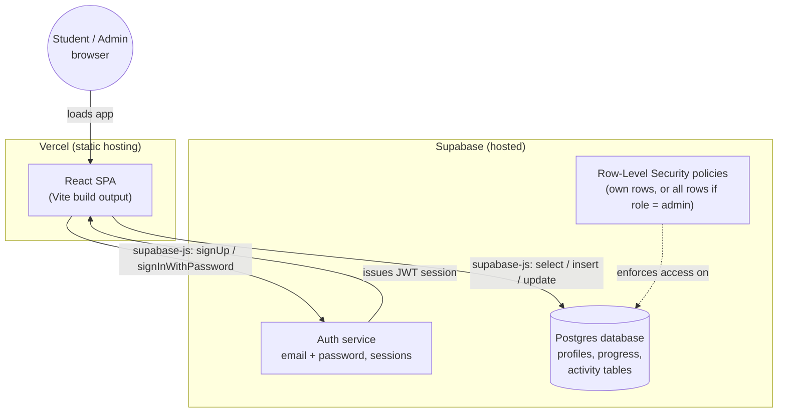
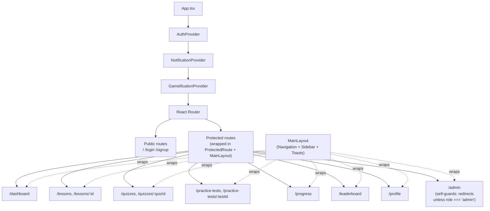
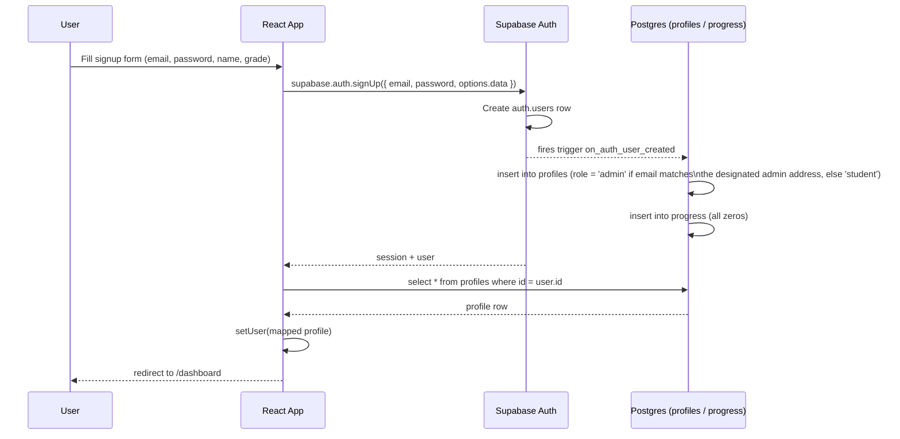
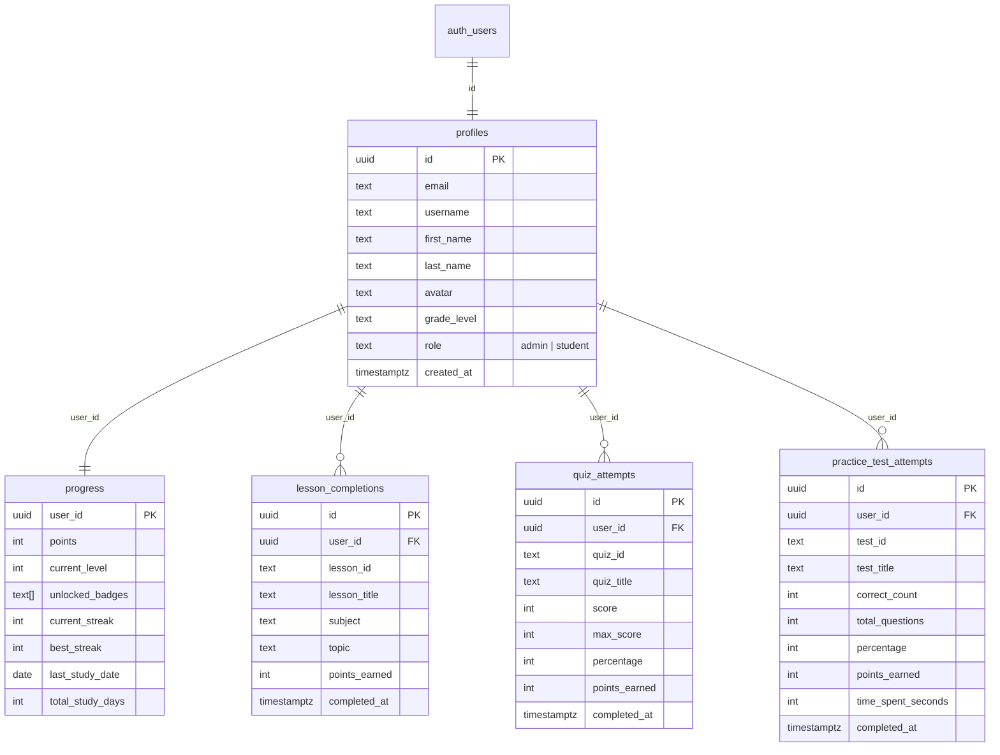
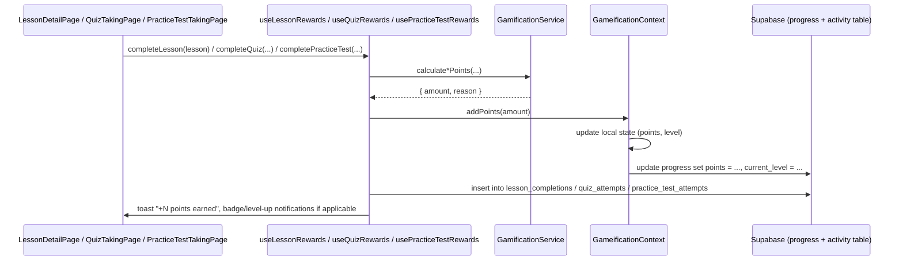

# Architecture

This document explains how the SAT/PSAT Prep Platform is put together: the overall system, the React provider/component tree, the auth flow, the database schema, and how a completed lesson/quiz/test turns into data an admin can see.

For setup instructions, see [README.md](./README.md) and [SUPABASE_SETUP.md](./SUPABASE_SETUP.md).

## 1. System Overview

The app is a client-side single-page app (SPA) — there is no custom backend server. **Supabase** plays the role a hand-rolled backend normally would: it provides authentication, a Postgres database, and access control (row-level security), all reachable directly from the browser via `supabase-js`.



Everything a student *reads* (lesson text, quiz questions, badge definitions, level thresholds) is static TypeScript data bundled into the app at build time (`src/data/`). Only *account state and progress* — who's signed up, their points/streak/badges, and their history of completed lessons/quizzes/tests — lives in Supabase. That split is what makes the admin dashboard possible: progress is centralized in a real database instead of being trapped in each student's browser localStorage.

## 2. Provider & Component Hierarchy

`src/App.tsx` wraps the whole app in three context providers before the router. Order matters: `GameificationProvider` reads the logged-in user from `AuthProvider` (it needs to know *whose* progress to load), so `AuthProvider` must be the outermost provider.



`ProtectedRoute` (`src/components/auth/ProtectedRoute.tsx`) checks `isAuthenticated` from `AuthContext` and redirects to `/login` if there's no session. The admin route adds a second, page-level check: `AdminDashboardPage` redirects to `/dashboard` if the logged-in user's `role !== 'admin'`.

### Contexts

| Context | File | Responsibility |
|---|---|---|
| `AuthContext` | `src/context/AuthContext.tsx` | Wraps Supabase Auth: `login`, `signup`, `logout`, restores session on load, exposes `user` (mapped from the `profiles` table) |
| `GameificationContext` | `src/context/GameificationContext.tsx` | Loads/saves the logged-in user's `progress` row (points, level, streak, badges); resets to zero when nobody's logged in |
| `NotificationContext` | `src/context/NotificationContext.tsx` | Toast notifications (success/error messages, achievement popups) |

## 3. Auth Flow

Supabase Auth owns passwords and sessions; the app never sees or stores a plaintext or hashed password itself. A Postgres trigger (`handle_new_user`, in `supabase/schema.sql`) automatically creates matching `profiles` and `progress` rows the instant someone signs up — the app doesn't have to do that as a separate step.



Login (`signInWithPassword`) follows the same shape minus the trigger: Supabase verifies the password, returns a session, and the app fetches the matching `profiles` row to populate `AuthContext`.

## 4. Database Schema

Defined in full in [`supabase/schema.sql`](./supabase/schema.sql).



**Row-level security** is enabled on all five tables. Every `select` policy follows the same shape:

```sql
using (auth.uid() = user_id or public.is_admin())
```

`is_admin()` is a `security definer` SQL function that checks whether the currently authenticated user's `profiles.role = 'admin'`. This is what lets the Admin Dashboard read every student's data while a regular student's queries only ever return their own rows — enforced by Postgres itself, not by app-level code.

## 5. How a Completed Lesson Becomes a Database Row

Points, badges, and activity logging are triggered from three "reward" hooks, one per activity type: `useLessonRewards`, `useQuizRewards`, `usePracticeTestRewards` (all in `src/hooks/`). They share the same pattern:



The point-calculation logic itself is a pure, testable class (`GamificationService`, `src/services/GamificationService.ts`) — difficulty-based base points plus a bonus for high scores, kept separate from the React state management in `GameificationContext`.

The activity-table insert is fire-and-forget: if it fails (e.g. a network hiccup), the student still gets their points and sees a success toast — only the admin's activity-history view would be missing that one row. This trades a small amount of admin-visibility robustness for never blocking the student's experience on a logging call.

## 6. Static Content ("the database that isn't a database")

Lessons, quizzes, practice test questions, badge definitions, and level thresholds are all plain TypeScript arrays under `src/data/`, aggregated by an `index.ts` per folder (e.g. `src/data/lessons/index.ts` exports `allLessons` plus lookup helpers like `getLessonById`). Pages only ever import from these `index.ts` files, never from the individual topic files directly. This content is compiled into the app bundle — there's no CMS or content API, so adding a lesson means editing a TypeScript file and redeploying.

## 7. Known Architectural Gaps

- `src/pages/PracticeTestTakingPage.tsx` (the full-length, multi-section test flow reachable from `/practice-tests`) uses one shared, generic question bank (`src/data/tests/testQuestions.ts`) for every test rather than per-test questions.
- The topic-specific 50-question practice tests built under `src/data/practiceTests/` (of type `Quiz`, not `PracticeTest`) are exported and ready to use but aren't linked from any page yet.
- `src/utils/passwordHash.ts` and the old `src/data/mockUsers.ts` are empty deprecated stubs left over from before the Supabase migration (kept only because this environment couldn't delete files) — safe to delete by hand if you want a cleaner tree.
