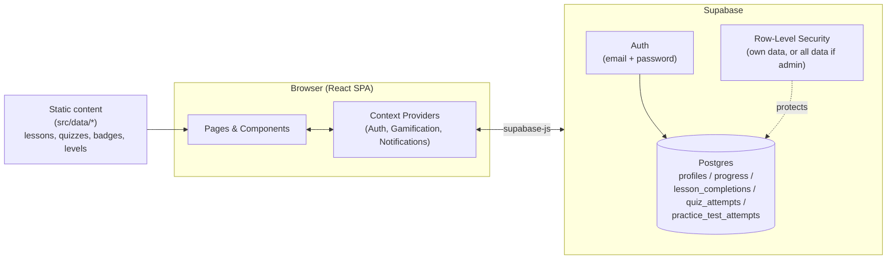

# SAT/PSAT Prep Platform

A gamified SAT/PSAT test-prep web app: lessons, quizzes, and full-length practice tests across Math, Reading & Writing, and Essay — with points, levels, streaks, badges, and an admin dashboard for tracking every student's progress.

Built with **React 18 + TypeScript + Vite** on the frontend and **Supabase** (Postgres + Auth) as the backend.

For a deeper technical walkthrough with diagrams, see **[ARCHITECTURE.md](./ARCHITECTURE.md)**.

## Features

- **Lessons** — 44 lessons across Algebra, Geometry, Data Analysis, Word Problems, Vocabulary, Grammar, Reading Comprehension, and Essay Writing, each with 20+ original practice questions.
- **Quizzes** — topic-specific quizzes (20 questions each) for quick knowledge checks, separate from lesson and practice test questions.
- **Practice Tests** — full-length, timed, multi-section tests that score real answers (not simulated).
- **Gamification** — points, 7 levels, daily streaks, and 16 unlockable badges.
- **Accounts** — real email/password auth via Supabase (no more demo/mock users).
- **Admin Dashboard** — the admin account can see every student's points, level, streak, badges, and full activity history (every lesson/quiz/test they've completed, with scores and timestamps) — live from the database, not just one browser's local storage.

## Tech Stack

| Layer | Technology |
|---|---|
| UI | React 18, TypeScript, React Router |
| Build tool | Vite |
| Styling | Plain CSS (no Tailwind/CSS-in-JS) |
| Icons / Charts | lucide-react, recharts |
| Backend | Supabase (Postgres, Auth, Row-Level Security) |
| Hosting | Vercel (frontend) + Supabase (backend) |

## Architecture at a Glance



The app itself is a single-page app with no custom backend server — Supabase provides auth, the database, and access control directly to the browser. All lesson/quiz/practice-test *content* is bundled with the app as static TypeScript data; only *progress* (accounts, points, history) lives in Supabase. See [ARCHITECTURE.md](./ARCHITECTURE.md) for the provider hierarchy, auth flow, database schema (ER diagram), and how a lesson/quiz completion turns into a database row.

## Getting Started

### 1. Install dependencies

```bash
npm install
```

### 2. Set up the backend

This app needs a free Supabase project for accounts and progress storage. Follow **[SUPABASE_SETUP.md](./SUPABASE_SETUP.md)** — it walks through creating the project, running `supabase/schema.sql`, and getting your API keys.

### 3. Configure environment variables

```bash
cp .env.example .env.local
```

Fill in `VITE_SUPABASE_URL` and `VITE_SUPABASE_ANON_KEY` from your Supabase project settings.

### 4. Run the dev server

```bash
npm run dev
```

Opens on `http://localhost:5173`.

### 5. Sign up

Go to `/signup`. Signing up with **sriny3@gmail.com** grants admin access (see `supabase/schema.sql`); any other email becomes a regular student account.

## Available Scripts

Run from `SAT Training Prep/` (the folder containing `package.json`):

| Command | Purpose |
|---|---|
| `npm install` | Install dependencies |
| `npm run dev` | Start the Vite dev server (`0.0.0.0:5173`) |
| `npm run build` | Type-check (`tsc`) then build to `dist/` |
| `npm run preview` | Serve the production build locally |
| `npm run lint` | ESLint on `.ts`/`.tsx` |

There is no automated test suite; `test-app.js` / `test-app.mjs` are ad-hoc smoke scripts.

## Project Structure

```
src/
├── App.tsx                 # Route table + provider tree
├── main.tsx                 # React entry point
├── components/
│   ├── auth/                 # LoginForm, SignupForm, ProtectedRoute
│   ├── layout/                # Navigation, Sidebar, MainLayout
│   ├── gamification/           # Badge display, level progress, achievement toasts
│   ├── common/                  # Toast notifications
│   └── styles/                   # Plain CSS, imported directly by components
├── context/                 # AuthContext, GameificationContext, NotificationContext
├── hooks/                   # useAuth, useGameification, useLessonRewards,
│                             # useQuizRewards, usePracticeTestRewards, useNotification
├── lib/
│   └── supabaseClient.ts     # Supabase client (reads VITE_SUPABASE_* env vars)
├── pages/                   # One component per route (see App.tsx)
├── services/
│   └── GamificationService.ts # Pure point/badge calculation logic
├── data/                    # Static seed content — the "content database"
│   ├── lessons/               # Algebra, Geometry, Data Analysis, Word Problems,
│   │                            Vocabulary, Grammar, Reading, Essay
│   ├── quizzes/                # Topic quizzes
│   ├── practiceTests/           # 50-question topic practice tests
│   ├── tests/                    # Full-length multi-section practice tests
│   ├── questions/                 # Lesson-specific practice questions
│   └── gamification/               # Badge and level definitions
├── types/
│   └── index.ts              # Single source of truth for all TypeScript types
└── utils/                    # (currently unused stubs)

supabase/
└── schema.sql                # Full Postgres schema: tables, trigger, RLS policies
```

Path imports are relative (no aliases). Domain enums (`Subject`, `TopicType`, `DifficultyLevel`) are string-literal unions defined once in `src/types/index.ts`.

## Database Schema (Supabase)

| Table | Purpose |
|---|---|
| `profiles` | Name, email, grade level, role (`admin` \| `student`) — one row per account |
| `progress` | Points, level, streak, badges — one row per account |
| `lesson_completions` | One row per lesson a student finishes |
| `quiz_attempts` | One row per quiz submission, with score |
| `practice_test_attempts` | One row per practice test submission, with score |

Every table has row-level security: an account can read/write only its own rows, except the admin account, which can read every row. Full DDL lives in [`supabase/schema.sql`](./supabase/schema.sql); the entity-relationship diagram is in [ARCHITECTURE.md](./ARCHITECTURE.md#database-schema).

## Deployment

- **Frontend**: deploy to Vercel (or any static host) — it's a Vite SPA. Set `VITE_SUPABASE_URL` and `VITE_SUPABASE_ANON_KEY` as environment variables in your hosting provider.
- **Backend**: Supabase is already hosted — nothing to deploy. Just make sure `supabase/schema.sql` has been run against your project.

## Known Limitations

- No automated tests.
- The full-length practice test flow (`/practice-tests/:testId`) shares one generic question bank (`src/data/tests/testQuestions.ts`) across all tests rather than per-test question sets; the topic-specific 50-question tests in `src/data/practiceTests/` exist as data but aren't yet wired into a page.
- No password reset flow yet (Supabase supports it — not implemented in the UI).
- No mobile app; this is a responsive web app only.

## License

MIT License — see `LICENSE` file for details.
